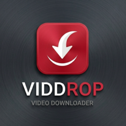

<div align="center">

  

  # ViddRop — Téléchargeur Vidéo & Musique Universel

  **Téléchargez et convertissez facilement vos vidéos et musiques préférées en haute définition (HD & 4K) et sans filigrane.**

  [](https://www.python.org/)
  []()
  [](LICENSE)
  []()
  []()

  [Fonctionnalités](#-fonctionnalités-clés) •
  [Écosystème](#-un-écosystème-complet-sur-3-plateformes) •
  [Installation](#-guide-de-démarrage-rapide) •
  [Compilation](#-compilation-en-exécutable-windows-exe) •
  [Licence](#-licence)

</div>

---

## 🌟 Fonctionnalités Clés

- **⚡ Simple & Rapide** : Collez un lien, choisissez votre format (MP4 ou MP3), et téléchargez en 1 clic.
- **🚫 Zéro Filigrane** : Téléchargement propre des vidéos TikTok et Instagram Reels sans logo.
- **💎 Qualité HD & 4K** : Prise en charge des flux haute définition jusqu'au 4K 60 FPS avec son stéréo limpide.
- **🎨 Design Ultra-Moderne Glassmorphism** : Interface sombre en verre dépoli avec lueurs néon et support natif de l'effet Acrylic de Windows 11.
- **📱 Compatible Tous Écrans** : Recadrez vos vidéos au format smartphone (9:16 vertical), écran large (16:9) ou carré (1:1).
- **🔊 Son Équilibré Automatique** : Normalisation sonore pour un volume constant et agréable sur tous vos appareils.
- **📋 Détection Presse-Papier** : Détecte automatiquement les liens copiés dans votre navigateur sans avoir à faire `Ctrl+V`.

---

## 🌐 Un Écosystème Complet sur 3 Plateformes

```
viddrop/
├── viddrop_pro.py          # 🖥️ Application Bureau Windows (Glassmorphism)
├── build_exe.py            # 📦 Compilateur PyInstaller automatique
├── installer_setup.iss     # 💿 Script Inno Setup (génère ViddRop_Setup.exe)
│
├── web/                    # 🌐 Plateforme Web en Ligne
│   ├── index.html          # Page web Glassmorphism responsive
│   ├── server.py           # Serveur API Python léger
│   └── static/             # Styles CSS néon et moteur JavaScript
│
└── android/                # 📱 Application Mobile Android
    ├── manifest.json       # Manifest PWA avec menu « Partager » Android
    ├── service-worker.js   # Cache hors-ligne et installation rapide
    └── capacitor.config.json # Configuration pour compilation en APK natif
```

---

## 🚀 Guide de Démarrage Rapide

### 1. Prérequis
- [Python 3.9+](https://www.python.org/downloads/)
- [FFmpeg](https://ffmpeg.org/) (optionnel si vous utilisez le package complet)

### 2. Installation des dépendances
```bash
git clone https://github.com/votre-nom/viddrop.git
cd viddrop
pip install -r requirements.txt
```

---

### 🖥️ Lancer l'Application Bureau (PC)
```bash
python viddrop_pro.py
```
> *Astuce Windows : vous pouvez aussi simplement double-cliquer sur `lancer_logiciel.bat`.*

---

### 🌐 Lancer le Site Web & Téléchargeur en Ligne
```bash
python web/server.py
```
Ouvrez ensuite votre navigateur sur **`http://localhost:8080`**.
> *Astuce Windows : vous pouvez aussi simplement double-cliquer sur `lancer_site.bat`.*

---

### 📱 Installer sur Android
1. Lancez le serveur web sur votre PC (`python web/server.py`).
2. Sur votre smartphone Android connecté au même Wi-Fi, ouvrez Chrome et tapez l'adresse de votre PC (ex: `http://192.168.1.50:8080`).
3. Chrome vous propose automatiquement : **« Ajouter à l'écran d'accueil »**.
4. **Magie du partage** : Dans TikTok ou YouTube, appuyez sur **Partager > ViddRop** : le lien est automatiquement importé et prêt à être téléchargé !

---

## 📦 Compilation en Exécutable Windows (.exe)

Pour créer un fichier autonome `ViddRop.exe` sans console noire CMD :

```bash
python build_exe.py
```
Le fichier exécutable sera généré dans le dossier `dist/ViddRop.exe`.

Pour générer un installateur officiel avec raccourcis Bureau :
- Ouvrez [`installer_setup.iss`](installer_setup.iss) dans [Inno Setup](https://jrsoftware.org/isdl.php) et cliquez sur **Compile**.

---

## 🎬 Formats Pris en Charge

| Format | Type | Description |
| :--- | :--- | :--- |
| **MP4** | Vidéo | Format universel haute définition compatible PC, Mac, smartphones et TV |
| **MP3** | Audio | Musique en qualité maximale 320 kbps |
| **WAV** | Audio | Qualité sonore pure non compressée |
| **MOV** | Vidéo | Format haute fidélité pour appareils Apple et PC |
| **WEBM** | Vidéo | Format web ultra-léger et rapide |
| **GIF** | Animation | Extrait vidéo transformé en image animée |

---

## 🤝 Contribution

Les contributions sont les bienvenues !
1. Forkez le projet
2. Créez votre branche (`git checkout -b feature/nouvelle-fonctionnalite`)
3. Committez vos modifications (`git commit -m 'Ajout d'une nouvelle fonctionnalité'`)
4. Pushez vers la branche (`git push origin feature/nouvelle-fonctionnalite`)
5. Ouvrez une Pull Request

---

## 📄 Licence

Ce projet est sous licence **MIT** — voir le fichier [LICENSE](LICENSE) pour plus de détails.
